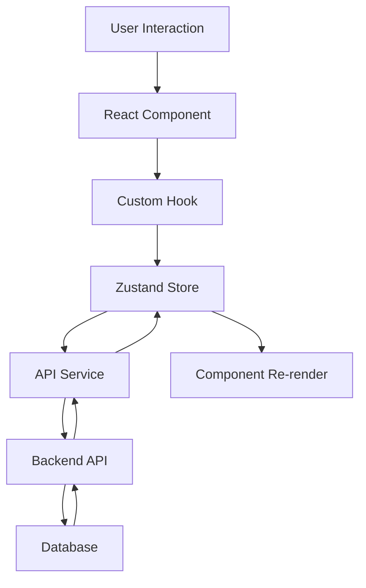
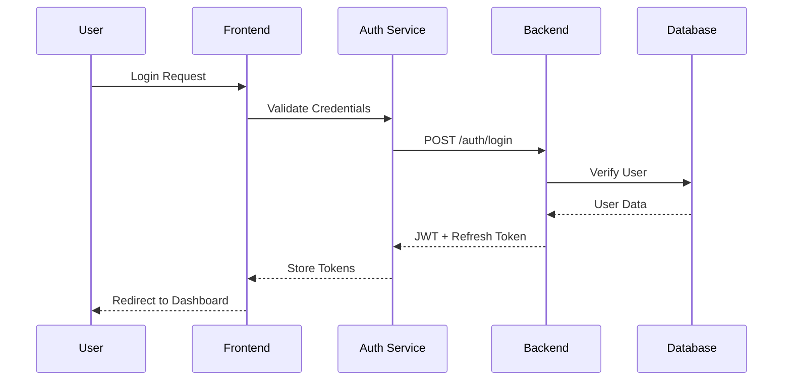
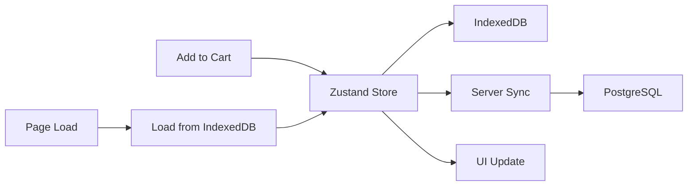

# 🏗️ Arquitectura Técnica - NexusShop

## 📋 Tabla de Contenidos
- [Visión General](#-visión-general)
- [Decisiones Arquitectónicas](#-decisiones-arquitectónicas)
- [Estructura del Monorepo](#-estructura-del-monorepo)
- [Flujo de Datos](#-flujo-de-datos)
- [Patrones de Diseño](#-patrones-de-diseño)
- [Seguridad](#-seguridad)
- [Performance](#-performance)
- [Escalabilidad](#-escalabilidad)

---

## 🎯 Visión General

NexusShop está diseñado como un **monorepo moderno** que implementa una arquitectura **microservicios** con separación clara entre frontend, backend y librerías compartidas.

### 🏛️ Principios Arquitectónicos

1. **Separation of Concerns** - Cada módulo tiene una responsabilidad específica
2. **DRY (Don't Repeat Yourself)** - Código reutilizable en packages compartidos
3. **SOLID Principles** - Diseño orientado a objetos robusto
4. **Clean Architecture** - Dependencias apuntan hacia el centro
5. **Domain-Driven Design** - Modelado basado en el dominio del negocio

---

## 🧠 Decisiones Arquitectónicas

### 📦 **Monorepo vs Multirepo**
**Decisión**: Monorepo con Turborepo
**Razón**: 
- Facilita el desarrollo y testing conjunto
- Versionado sincronizado de dependencias
- Reutilización de código entre apps
- CI/CD simplificado

### 🎨 **Frontend: React vs Vue vs Angular**
**Decisión**: React 18 con TypeScript
**Razón**:
- Ecosistema maduro y amplio
- Mejor soporte para 3D (Three.js)
- Hooks modernos para state management
- Comunidad activa y documentación

### ⚙️ **Backend: Node.js vs Python vs Go**
**Decisión**: Node.js con Express
**Razón**:
- Mismo lenguaje que frontend (TypeScript)
- Ecosistema NPM rico
- Excelente para APIs REST
- Fácil integración con servicios externos

### 🗄️ **Base de Datos: PostgreSQL vs MongoDB**
**Decisión**: PostgreSQL con Prisma ORM
**Razón**:
- ACID compliance para transacciones
- Mejor para datos relacionales (productos, usuarios, órdenes)
- Prisma ofrece type-safety
- Escalabilidad horizontal con sharding

### 🚀 **State Management: Redux vs Zustand**
**Decisión**: Zustand
**Razón**:
- Menos boilerplate que Redux
- TypeScript nativo
- Mejor performance
- API más simple y moderna

---

## 📁 Estructura del Monorepo

```
NexusShop/
├── 📁 apps/
│   ├── 📁 frontend/                 # React App
│   │   ├── 📁 src/
│   │   │   ├── 📁 components/       # Componentes React
│   │   │   ├── 📁 pages/           # Páginas/Rutas
│   │   │   ├── 📁 stores/          # Zustand stores
│   │   │   ├── 📁 hooks/           # Custom hooks
│   │   │   ├── 📁 services/        # API calls
│   │   │   ├── 📁 utils/           # Utilidades
│   │   │   └── 📁 types/           # Tipos TypeScript
│   │   ├── 📄 vite.config.ts       # Configuración Vite
│   │   └── 📄 package.json
│   │
│   └── 📁 backend/                  # Node.js API
│       ├── 📁 src/
│       │   ├── 📁 controllers/     # Controladores REST
│       │   ├── 📁 services/        # Lógica de negocio
│       │   ├── 📁 models/          # Modelos Prisma
│       │   ├── 📁 middleware/      # Middleware Express
│       │   ├── 📁 routes/          # Definición de rutas
│       │   ├── 📁 utils/           # Utilidades
│       │   └── 📁 types/           # Tipos TypeScript
│       ├── 📁 prisma/              # Schema y migraciones
│       └── 📄 package.json
│
├── 📁 packages/
│   ├── 📁 design-system/           # Componentes UI
│   │   ├── 📁 src/
│   │   │   ├── 📁 components/      # Componentes base
│   │   │   ├── 📁 tokens/          # Design tokens
│   │   │   ├── 📁 styles/          # Estilos globales
│   │   │   └── 📁 utils/           # Utilidades UI
│   │   └── 📄 package.json
│   │
│   ├── 📁 shared/                   # Código compartido
│   │   ├── 📁 src/
│   │   │   ├── 📁 types/           # Tipos compartidos
│   │   │   ├── 📁 utils/           # Utilidades comunes
│   │   │   ├── 📁 constants/       # Constantes
│   │   │   └── 📁 validators/      # Validadores
│   │   └── 📄 package.json
│   │
│   └── 📁 cli/                      # CLI para desarrollo
│       ├── 📁 src/
│       │   ├── 📁 commands/        # Comandos CLI
│       │   ├── 📁 templates/       # Templates de código
│       │   └── 📁 utils/           # Utilidades CLI
│       └── 📄 package.json
│
├── 📁 .github/workflows/           # CI/CD
├── 📁 docs/                        # Documentación
├── 🐳 docker-compose.yml
├── ⚡ turbo.json
└── 📄 package.json
```

---

## 🔄 Flujo de Datos

### 📱 **Frontend Data Flow**



### 🔐 **Authentication Flow**



### 🛒 **Cart Management Flow**



---

## 🎨 Patrones de Diseño

### 🏭 **Factory Pattern**
```typescript
// Design System Component Factory
export const createComponent = (type: ComponentType) => {
  switch (type) {
    case 'button':
      return Button;
    case 'input':
      return Input;
    default:
      throw new Error(`Unknown component type: ${type}`);
  }
};
```

### 🎯 **Observer Pattern**
```typescript
// Zustand Store (Observer Pattern)
export const useCartStore = create<CartStore>((set, get) => ({
  items: [],
  addItem: (item) => {
    set(state => ({ items: [...state.items, item] }));
    // Notify observers (React components)
  }
}));
```

### 🔧 **Strategy Pattern**
```typescript
// Payment Strategy
interface PaymentStrategy {
  process(amount: number): Promise<PaymentResult>;
}

class StripePayment implements PaymentStrategy {
  async process(amount: number): Promise<PaymentResult> {
    // Stripe implementation
  }
}

class PayPalPayment implements PaymentStrategy {
  async process(amount: number): Promise<PaymentResult> {
    // PayPal implementation
  }
}
```

### 🏗️ **Builder Pattern**
```typescript
// API Query Builder
class QueryBuilder {
  private query: string = '';
  
  select(fields: string[]): this {
    this.query += `SELECT ${fields.join(', ')} `;
    return this;
  }
  
  from(table: string): this {
    this.query += `FROM ${table} `;
    return this;
  }
  
  where(condition: string): this {
    this.query += `WHERE ${condition} `;
    return this;
  }
  
  build(): string {
    return this.query.trim();
  }
}
```

---

## 🔒 Seguridad

### 🛡️ **Autenticación y Autorización**

```typescript
// JWT Middleware
export const authenticateToken = (req: Request, res: Response, next: NextFunction) => {
  const authHeader = req.headers['authorization'];
  const token = authHeader && authHeader.split(' ')[1];

  if (!token) {
    return res.sendStatus(401);
  }

  jwt.verify(token, process.env.JWT_SECRET!, (err, user) => {
    if (err) return res.sendStatus(403);
    req.user = user;
    next();
  });
};
```

### 🔐 **Validación de Datos**

```typescript
// Zod Schema Validation
import { z } from 'zod';

export const userSchema = z.object({
  email: z.string().email(),
  password: z.string().min(8),
  name: z.string().min(2).max(50),
});

export const validateUser = (data: unknown) => {
  return userSchema.parse(data);
};
```

### 🛡️ **Rate Limiting**

```typescript
// Express Rate Limiter
import rateLimit from 'express-rate-limit';

export const apiLimiter = rateLimit({
  windowMs: 15 * 60 * 1000, // 15 minutes
  max: 100, // limit each IP to 100 requests per windowMs
  message: 'Too many requests from this IP',
});
```

---

## ⚡ Performance

### 🚀 **Frontend Optimizations**

1. **Code Splitting**
```typescript
// Lazy loading components
const ProductViewer = lazy(() => import('./components/Product3DViewer'));
```

2. **Memoization**
```typescript
// React.memo for expensive components
export const ExpensiveComponent = React.memo(({ data }) => {
  return <div>{/* Complex rendering */}</div>;
});
```

3. **Virtual Scrolling**
```typescript
// For large product lists
import { FixedSizeList as List } from 'react-window';
```

### 🗄️ **Backend Optimizations**

1. **Database Indexing**
```sql
-- Product search optimization
CREATE INDEX idx_products_search ON products USING GIN(to_tsvector('english', name || ' ' || description));
```

2. **Redis Caching**
```typescript
// Cache frequently accessed data
export const getCachedProducts = async (category: string) => {
  const cached = await redis.get(`products:${category}`);
  if (cached) return JSON.parse(cached);
  
  const products = await db.product.findMany({ where: { category } });
  await redis.setex(`products:${category}`, 3600, JSON.stringify(products));
  return products;
};
```

3. **Connection Pooling**
```typescript
// Prisma connection pooling
export const prisma = new PrismaClient({
  datasources: {
    db: {
      url: process.env.DATABASE_URL + '?connection_limit=20&pool_timeout=20',
    },
  },
});
```

---

## 📈 Escalabilidad

### 🔄 **Horizontal Scaling**

1. **Load Balancing**
```yaml
# docker-compose.yml
version: '3.8'
services:
  nginx:
    image: nginx:alpine
    ports:
      - "80:80"
    volumes:
      - ./nginx.conf:/etc/nginx/nginx.conf
  
  backend-1:
    build: ./apps/backend
    environment:
      - NODE_ENV=production
  
  backend-2:
    build: ./apps/backend
    environment:
      - NODE_ENV=production
```

2. **Database Sharding**
```typescript
// Shard by user ID
export const getShardedConnection = (userId: string) => {
  const shard = parseInt(userId.slice(-1)) % 3; // 3 shards
  return shardConnections[shard];
};
```

### 📊 **Monitoring y Observabilidad**

1. **Health Checks**
```typescript
// Health check endpoint
app.get('/health', async (req, res) => {
  const dbStatus = await checkDatabaseConnection();
  const redisStatus = await checkRedisConnection();
  
  res.json({
    status: 'ok',
    timestamp: new Date().toISOString(),
    services: {
      database: dbStatus,
      redis: redisStatus,
    },
  });
});
```

2. **Metrics Collection**
```typescript
// Prometheus metrics
import client from 'prom-client';

const httpRequestDuration = new client.Histogram({
  name: 'http_request_duration_seconds',
  help: 'Duration of HTTP requests in seconds',
  labelNames: ['method', 'route', 'status'],
});
```

---

## 🔮 Futuras Mejoras

### 🚀 **Microservicios**
- Separar autenticación en servicio independiente
- Servicio dedicado para recomendaciones AI
- Servicio de notificaciones en tiempo real

### 🌐 **CDN y Edge Computing**
- Implementar Cloudflare para assets estáticos
- Edge functions para personalización
- Geographic distribution

### 📱 **Mobile-First**
- Progressive Web App avanzada
- App nativa con React Native
- Sincronización offline robusta

---

<div align="center">
  <h3>📚 Documentación Técnica Completa</h3>
  <p>Esta arquitectura está diseñada para escalar y evolucionar con las necesidades del negocio</p>
</div> 